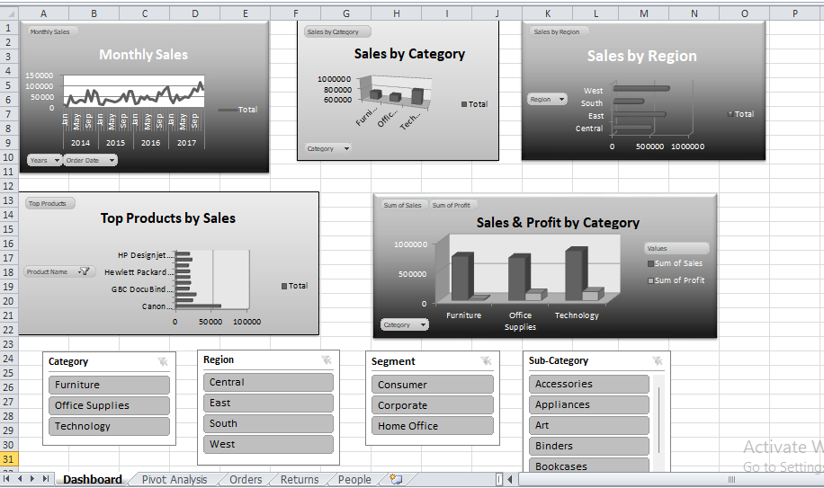

# Retail Sales Analysis – Excel

## Project Overview

This project focuses on analyzing retail sales data using Microsoft Excel to identify sales and profitability patterns and present them through an interactive dashboard.

The analysis covers sales performance across different product categories, sub-categories, regions, customer segments, and time periods.

## What I Did

- Cleaned and prepared the dataset for analysis.
- Used Pivot Tables to summarize and analyze sales and profit.
- Created Pivot Charts to visualize key findings.
- Added interactive Slicers to filter the dashboard.
- Built an interactive dashboard to provide a clear overview of sales performance.

## Key Analysis

- Monthly Sales Trends
- Sales by Category
- Sales by Region
- Top Products by Sales
- Sales & Profit by Category
- Performance by Customer Segment

## Tools & Skills

- Microsoft Excel
- Data Cleaning
- Pivot Tables
- Pivot Charts
- Slicers
- Dashboard Design
- Sales & Profit Analysis

## Dashboard

